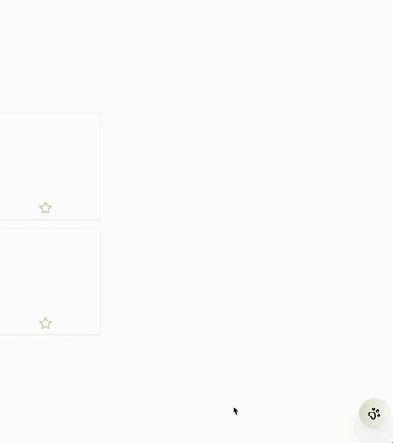

# ChefTed

Cette application vous aide à générer des menus équilibrés pour la semaine, en prenant en compte vos régimes alimentaires et vos allergies. De plus, vous pouvez discuter avec un chef cuisinier virtuel alimenté par l'IA pour obtenir des conseils de cuisine personnalisés et des recommandations de recettes.

## To do
- [ ] Ajouter des precisions dans le prompts du chat pour le centrer sur la cuisine et lui donner son nom

## Fonctionnalités

- **Menus Équilibrés :** Générez des menus hebdomadaires équilibrés sur le plan nutritionnel, adaptés à vos besoins alimentaires spécifiques.
- **Régimes Alimentaires :** Personnalisez les menus en fonction de vos régimes alimentaires tels que végétarien, végétalien, cétogène, paléo, etc.
- **Prise en Compte des Allergies :** Assurez-vous que les menus évitent les ingrédients auxquels vous êtes allergique, garantissant ainsi votre sécurité et votre tranquillité d'esprit.
- **Chat avec un Assistant IA :** Discutez avec un chef cuisinier virtuel (Chef Ted) alimenté par l'IA pour obtenir des conseils de cuisine, des suggestions de recettes et des substitutions d'ingrédients.

- **Intégration d'OpenAI :** Utilisez les puissantes capacités de traitement du langage naturel d'OpenAI pour améliorer l'expérience conversationnelle avec l'assistant cuisinier.

## Stack Technologique

### Frontend

- **ReactJS :** Une bibliothèque JavaScript populaire pour la construction d'interfaces utilisateur, offrant une expérience rapide et interactive pour les utilisateurs.
- **Yup :** Utilisé pour la validation des formulaires afin de garantir l'intégrité des données et la correction des saisies utilisateur.
- **React Router DOM :** Permet le routage dynamique pour une expérience de navigation sans heurts dans une application monopage.

### Backend

- **Express.JS :** Un framework minimaliste et flexible pour les applications web Node.js, offrant un ensemble robuste de fonctionnalités pour la construction d'APIs et d'applications web.

### UI Styling

- **Sass :** Un langage d'extension CSS puissant qui ajoute des fonctionnalités telles que les variables, les mixins et l'imbrication, facilitant ainsi l'organisation et la maintenance des feuilles de style.
- **MaterialUI :** Une bibliothèque d'interface utilisateur basée sur React qui offre une vaste gamme de composants pré-conçus, facilitant ainsi le développement d'interfaces utilisateur esthétiques et fonctionnelles.

### Contact

Si vous avez des questions ou des suggestions, n'hésitez pas à nous contacter.
